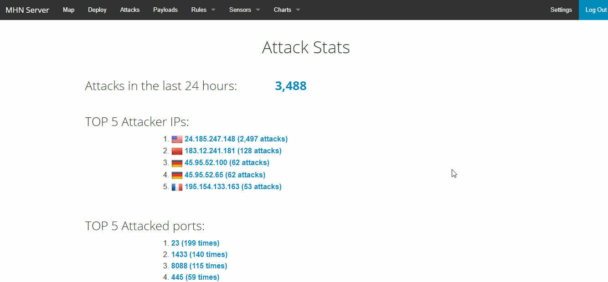

# Codepath-Cybersecurity-Honeypot

## Honeypots Deployed
The Dionaea honeypot was deployed to the MHN server.

## Issues Encountered
I encountered several issues. I had issues setting up the SSH because I was setting it up in PowerShell, but I found out I didn't need to do it in PowerShell. Another issue I encountered was exporting data. It took a long time to figure this out because I was inputting the wrong scp command, so I had to do some research to find the correct one.

## Summary of Data Collected
I let the honeypot run for more than 3 hours. At the time of this writing, there are 3575 attacks. Many of the protocols and Src IP were pcap 123.12.177.184 respectively.

## Unresolved Questions
I would like to know if more information can be derived from the attacks.
